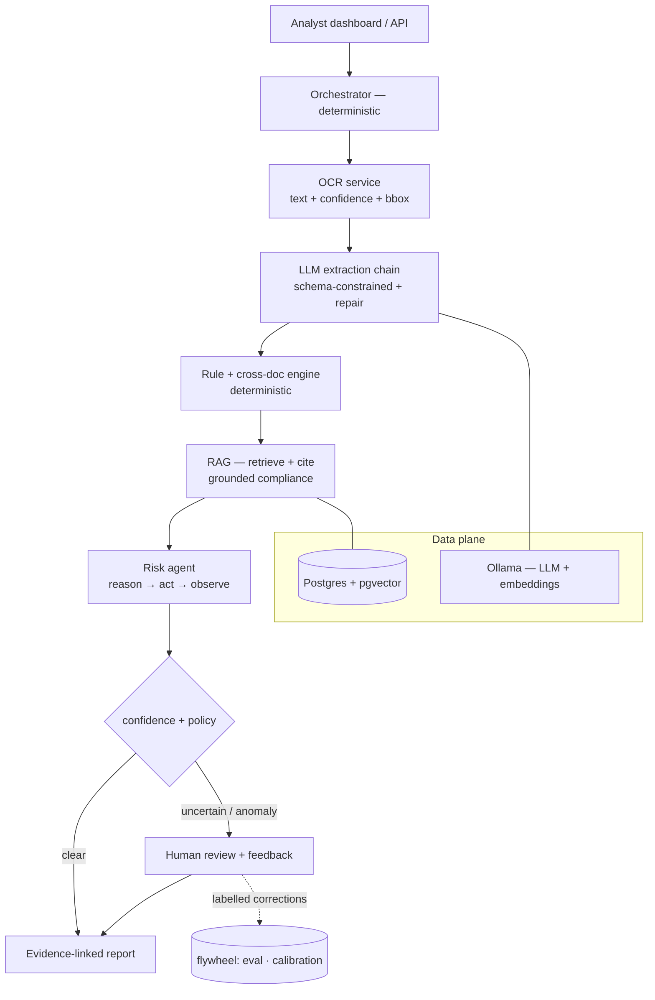

# EVIDENT
Explainable KYC Document Intelligence

**Every automated compliance decision is traceable to the evidence that produced it**;
an OCR span, a deterministic rule, a retrieved regulation, or a model probability.

Evident ingests KYC documents (national ID, passport, proof of address), extracts
structured identity fields with **calibrated confidence**, checks them with a
deterministic rule engine and across documents, grounds every compliance statement
in a **retrieved-and-cited** knowledge base, and routes uncertain or high-risk cases
to a human analyst. It is built to be *measured*: OCR, extraction, retrieval, and
confidence each have their own evaluation harness, and a CI job fails the build if a
metric regresses.

It runs **fully locally** (Ollama + Postgres), ships as Docker Compose, and needs
**no real identity document**, the dataset is synthetic and labelled.


%<!-- Add a screen recording of notebooks/demo.ipynb here — it's the best 20-second pitch.
%

---

## Why this project is different

Most "KYC + LLM" demos output `Status: Rejected` and a made-up confidence number.
Evident refuses both. Its organising principle is **traceability**, and every design
choice follows from it:

| Honest question | Evident's answer |
|---|---|
| Why was this rejected? | A finding list, each linked to its OCR span and the rule it broke |
| Which regulation applies? | A retrieved, **cited** passage from the knowledge base |
| How confident are we, in what? | A **calibrated** probability — *P(a human confirms this decision)*, with a measured ECE |
| Should a human look at this? | An explicit routing decision made by a tool-using agent, with a rationale |
| Do these documents match? | A structured cross-document consistency engine |
| Is the system any good? | A metrics suite (OCR / extraction / retrieval / calibration) gated in CI |

A second deliberate choice: **generative and deterministic components are kept
strictly separate.** Rules that must be exact (dates, ID formats, cross-document
matching) stay in code; the LLM is used only where genuine language understanding is
required (extraction, grounded explanation). There is exactly **one** real agent, the
risk/compliance step, because that is the only place where the next action genuinely
depends on what previous steps found.

---

## Architecture



Teal path = learned/generative components (measured + grounded). Everything else is
deterministic and unit-tested. The agent's recommendation is **advisory only**, a
human makes the binding decision.

---

## Results

Measured on the bundled synthetic set (reproduce with the commands below; your exact
numbers will vary with the seed and embedding backend).

| Layer | Metric | Result |
|---|---|---|
| Extraction | field-level F1 / exact-match | **0.95 / 0.92** (Tesseract + baseline) |
| Extraction | by difficulty | clean ≈ 0.96 → hard ≈ 0.46 (honest degradation) |
| RAG retrieval | Recall@3 / MRR | **0.79 / 0.79** (zero-dep hashing floor; higher with `sentence-transformers`) |
| Confidence | Expected Calibration Error | **0.185 → 0.115** (raw → calibrated) |
| Tests | `pytest` | **40 passing** |

```bash
python eval/run_all.py            # extraction + RAG
python scripts/train_confidence.py --data data/synthetic   # calibration (ECE raw vs calibrated)
python eval/check_thresholds.py   # the CI gate, locally
```

---

## Quickstart

**Prerequisites:** Python 3.11+, and the Tesseract OCR binary
([Windows](https://github.com/UB-Mannheim/tesseract/wiki) · `brew install tesseract` ·
`apt install tesseract-ocr`). On Windows, add it to `PATH` or set `TESSERACT_CMD` to
`tesseract.exe`.

```bash
git clone https://github.com/<user>/<repo>.git && cd evident
python -m venv .venv && source .venv/bin/activate      # Windows: .venv\Scripts\activate
pip install -e ".[dev,ocr,demo]"

python data/generate.py --n 50 --seed 42   # synthetic dataset with ground truth
pytest -q                                  # 40 passing
```

**See it work — the demo notebook** (the fastest tour of the whole system):

```bash
jupyter notebook notebooks/demo.ipynb
```
It runs the real pipeline on a document and shows every stage: OCR → extraction vs
ground truth → rules → cross-document consistency → per-field confidence → RAG-cited
reasoning → the risk agent → human review (through the live API) → the calibration
reliability diagram.

**Run the API:**

```bash
uvicorn evident.api.main:app --reload      # http://localhost:8000/  → interactive docs
```
JWT + RBAC (demo creds `analyst / analyst123`, `admin / admin123`). Log in at
`POST /auth/login`, then `POST /cases/{id}/analyze` (async → poll `/jobs/{id}`),
`GET /cases/{id}/report`, `POST /cases/{id}/qa` ("why was this flagged?"),
`POST /cases/{id}/review`, `GET /metrics`.

**Full local stack (optional — real Postgres + Ollama):**

```bash
docker compose up -d db ollama
docker compose exec ollama ollama pull qwen2.5:7b-instruct
docker compose exec ollama ollama pull bge-m3
docker compose up api
```

---

## What's inside

- **OCR** (`pipeline/ocr.py`) — Tesseract (default) or EasyOCR; text, per-word confidence, bounding boxes.
- **Extraction** (`pipeline/extract.py`) — a no-LLM regex/layout **baseline** *and* a schema-constrained **Ollama** extractor with a validate→repair loop.
- **Rule + cross-document engine** (`pipeline/rules.py`, `crossdoc.py`) — deterministic date/format/required-field checks and normalise-then-compare consistency.
- **RAG** (`rag/`) — a cited compliance knowledge base, pluggable embeddings (`sentence-transformers` → zero-dep hashing fallback), hybrid dense+lexical retrieval with RRF and metadata filtering, and five structural anti-hallucination defences.
- **Risk agent** (`agent/`) — one reason→act→observe agent with a tool belt and a recorded trajectory; deterministic policy by default, LLM policy optional.
- **Calibrated confidence** (`pipeline/confidence.py`) — a from-scratch logistic-regression calibrator → *P(human confirms)*, evaluated with ECE + a reliability diagram.
- **Human-in-the-loop** — review queue, `/review` + `/feedback` (the flywheel).
- **API** (`api/`) — FastAPI, JWT + RBAC, async jobs, evidence-linked reports.
- **Observability** (`obs/`) — structured logs, per-stage timings, `/metrics`.
- **Evaluation** (`eval/`) — from-scratch metrics (Recall@k, MRR, ECE), per-layer harnesses, and a **CI eval-gate** that fails on regressions.

```
src/evident/{api,pipeline,rag,agent,db,obs}   the system (importable, tested)
data/generate.py + knowledge_base/            synthetic data + RAG corpus
eval/                                          metric suites + thresholds gate
notebooks/demo.ipynb                           the visual walkthrough
scripts/train_confidence.py                    train the calibrator
tests/                                         pytest (40 tests)
```

---

## Tech stack

Python · PaddleOCR/Tesseract · Ollama (Llama 3 / Qwen) · sentence-transformers ·
PostgreSQL + pgvector · FastAPI + Pydantic · Streamlit · Docker Compose · GitHub Actions.

Deliberately **not** used: Kubernetes, LangChain as a hard dependency, a dedicated
vector DB — each would add surface area without teaching value at this scale. RAG,
the agent, and the metrics are written by hand rather than pulled from a framework, on
purpose.

## Roadmap

- [x] **P0–P2** — synthetic data, OCR + extraction, traceable pipeline + report 
- [x] **P3** — RAG: grounded, cited compliance reasoning
- [x] **P4** — risk agent · human-in-the-loop · calibrated confidence
- [x] **P5** — auth/RBAC · async · observability · eval harness + CI gate 
- [ ] **P6** — cross-encoder reranking · fine-tuned/VLM extractor · React front · public demo

## Data & privacy

The dataset is **synthetic** (generated field-first, so ground truth is free) and the
knowledge base is paraphrased policy text. No real identity documents are used or
required; any public demo should stay on synthetic data only. See the design blueprint
for the full data-minimisation / retention / audit discussion.

